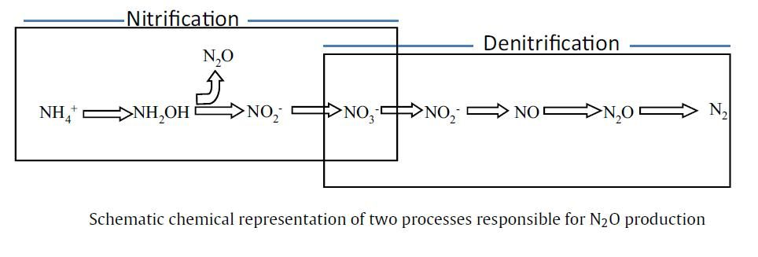
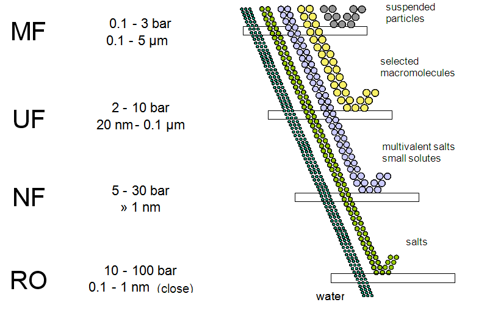

# Sewage Treatment

## Removal Efficiency for different treatment process

| | Primary Treatment | Chenically Enhanced Primary Treatment | Secondary Treatment | Tertiary Treatment |
| --- | --- | --- | --- | --- |
| Suspended Solids                |~70% | ~80% | >90% | ? |
| Biochemical Oxygen Demand (BOD) | ~30% | ~60% | >90% | ? |
| Treatment Duration | 2-3 Hr | 1.5 Hr | 18 Hr | ? | 

## Secondary Treatent procedures

### 1. Inlet Works
#### Mechanical Bar Screening
- For removal of solid exceeding 6mm 
#### Aerated Grit Channel

### 2. Primary Sedimentation Tank (Primary Treatment)
- Removes 50% of suspended soilds 
- Sludge removed by scrapers

### 3. Areation Tank (Secondary (Biological) Treatment)
**Working Mechanism:**  
1. Water in the Areation Tank is retained for 9 hours on average
1. Air bubble is being pumped into the tank, providing oxygen for the growth of micro-organisms (modified Ludzack-Ettinger (MLE) process)
1. assimilate organic pollutants

Reference: https://slideplayer.com/slide/4730725/

**Problem:** 

1. Air bubbles and micro-organism may gather at the corner of the tank
1.  surface scaper is installed to disperse them away from the corner. 

#### New Alternatives: Aerobic Granular Sludge Technology
- Allows the simultaneous removal of organic carbon, nitrogen, phosphorus in a sinlge treatment reactor. 
- Granular sludge are used instead of suspended sludge, allows a faster settling ability to separate sewage with sludge
- Higher capacity than aeration tank

#### New Alternatives: Membrane Bioreactor (MBR)
- Compact Sewage treatment
- Combines suspended growht of biological treatment process with membrane liquid-solid separation --> Treated sewage and suspended microrganisms. 
- Can have varying pore sizes for membranes, can reach to tertiary treatment level (Reverse Osmosis)

Reference:  [Innovative Technology for Sewage Treatment](https://www.dsd.gov.hk/EN/Publicity_and_Publications/Publicity/DSD_Sustainability_Reports/20/innovative_technology_for_sewage_treatment.html)

### 4. Final Sedimentation Tank
**Purpose:** 

- Separate treated sewage and activated sludge
#### Treated Sewage 
- To UV Disinfection System
#### Activated Sludge 
- To Sludge Digester & back to Areation Tank

### 5. UV disinfection System

### 6. Sludge Treatment Facilities

#### Sludge Digesters
- Allows Activated Sludge to undergo anaerobic digestion to generate methane
#### Centrifuges 
- To dewater sludge to 30% of its original content. 
- Transport Sludge to T Park for Incineration.

## Tertiatry Treatment Procedures

### Disc Filters
- Filters particles of 20 µm

### Ultra-Filtration Membranes
- Filters particles of 0.1 µm

### Reverse Osmosis Membrances
- Filters particles of 0.001 µm

## Treament Capacity of Sha Tin Sewage Treatment Plant
Current Capacity is 28/34 = 82% 